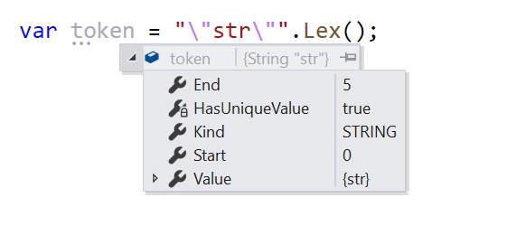

# GraphQL.NET Parser

[](https://github.com/graphql-dotnet/parser/actions/workflows/publish-release.yml)
[](https://github.com/graphql-dotnet/parser/actions/workflows/publish-preview.yml)

[](https://github.com/graphql-dotnet/parser/actions/workflows/test.yml)
[](https://github.com/graphql-dotnet/parser/actions/workflows/codeql-analysis.yml)
[](https://codecov.io/gh/graphql-dotnet/parser)

[](https://www.nuget.org/packages/GraphQL-Parser)
[](https://www.nuget.org/packages/GraphQL-Parser)


This library contains a lexer and parser as well as the complete [GraphQL AST model](http://spec.graphql.org/October2021/#sec-Appendix-Grammar-Summary)
that allows you to work with GraphQL documents compatible with the [October 2021 spec](https://spec.graphql.org/October2021/).

The parser from this library is used by the [GraphQL.NET](https://github.com/graphql-dotnet/graphql-dotnet) project
and was [verified](https://codecov.io/gh/graphql-dotnet/parser) by many test data sets.

Preview versions of this package are available on [GitHub Packages](https://github.com/orgs/graphql-dotnet/packages?repo_name=parser).

## 1. Lexer

Generates token based on input text. Lexer takes advantage of `ReadOnlyMemory<char>` and in most cases
does not allocate memory on the managed heap at all.

### Usage

```csharp
var token = Lexer.Lex("\"str\"");
```

Lex method always returns the first token it finds. In this case case the result would look like following.


## 2. Parser

Parses provided GraphQL expression into AST (abstract syntax tree). Parser also takes advantage of
`ReadOnlyMemory<char>` but still allocates memory for AST.

### Usage

```csharp
var ast1 = Parser.Parse(@"
{
  field
}");

var ast2 = Parser.Parse(@"
{
  field
}", new ParserOptions { Ignore = IgnoreOptions.Comments });
```

By default `ParserOptions.Ignore` is `IgnoreOptions.None`. If you want
to ignore all comments use `IgnoreOptions.Comments`. If you don't need
information about tokens locations in the source document, then use flag
`IgnoreOptions.Locations`. Or just use `IgnoreOptions.All` and this
will maximize the saving of memory allocated in the managed heap for AST.

## 3. ASTVisitor

`ASTVisitor` provides API to traverse AST of the parsed GraphQL document.
Default implementation traverses all AST nodes of the provided one. You can
inherit from it and override desired methods to implement your own AST
processing algorithm.

For printing SDL from AST, you can use `SDLPrinter`. This is a highly
optimized visitor for asynchronous non-blocking SDL output into provided
`TextWriter`. In the majority of cases it does not allocate memory in
the managed heap at all.

You can also find a `StructurePrinter` visitor that prints AST into the
provided `TextWriter` as a hierarchy of node types. It can be useful
when debugging for better understanding the AST structure.
Consider GraphQL document

```graphql
query a { name age }
```

After `StructurePrinter` processing the output text will be

```
Document
  OperationDefinition
    Name [a]
    SelectionSet
      Field
        Name [name]
      Field
        Name [age]
```

### Usage

```csharp
public static async Task Print(string text)
{
    using var document = Parser.Parse(text);
    var writer = new StringWriter(); 
    var printer = new SDLPrinter()
    await printer.PrintAsync(document, writer);
    var rendered = writer.ToString();
    Console.WriteLine(rendered);
}
```
